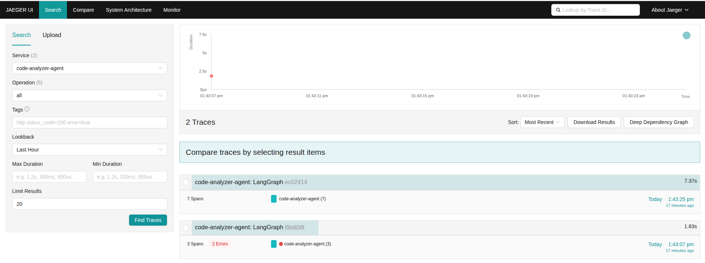

## 🚀 De la PoC a Producción: Gobernando la IA con "Harness Engineering"

Recientemente leí la excelente reflexión de Paradigma Digital sobre el Tech Radar de Thoughtworks en la era de la IA. Me dejó una pregunta clara: ¿cómo aportamos evidencia técnica real para gobernar estos sistemas?

La respuesta que propone Thoughtworks es el Harness Engineering (Ingeniería de Arnés): entender que el LLM es solo el motor, y nuestro trabajo como ingenieros es construir el "arnés" (memoria, guardarraíles, herramientas) que lo vuelve seguro y predecible.

Para validarlo, construí y **ya ejecuté de punta a punta** un ejercicio práctico:
🛠️ El Caso: Un Agente Autónomo Analizador y Refactorizador de Código.

- **Diseño primero, código después:** la arquitectura se acordó con OpenSpec (fase `propose`) antes de escribir una sola línea — proposal, spec con escenarios GIVEN/WHEN/THEN y decisiones de diseño documentadas, validadas con `openspec validate --strict` antes de implementar.
- **Orquestación (El Arnés):** LangGraph con 1 Orquestador ligero (un enrutador que solo lee banderas de estado, nunca analiza código ni llama al LLM) y 3 sub-agentes: Contexto (reglas de equipo en un `team-rules.md` local — Context Engineering sin Vector DB), Seguridad (revisión Zero Trust contra la API de Claude) y Refactor (corrige el código solo cuando Seguridad lo rechaza).
- **Límite de coste explícito:** máximo 3 ciclos Seguridad↔Refactor — el propio límite es evidencia de gobernanza, no un detalle técnico menor.
- **Observabilidad de IA:** instrumentado con OpenTelemetry (vía OpenInference sobre LangChain/LangGraph), exportando trazas a Jaeger y métricas a Prometheus a través de un OTel Collector — todo corriendo en Docker Compose, incluido el propio agente dockerizado.

### El resultado de la primera ejecución real

Le di al agente un fragmento de código con un secreto hardcodeado (una violación explícita de las reglas de equipo). Sin intervención humana:

1. **Seguridad** (Claude) detectó el hallazgo y marcó `is_valid = false`.
2. **Refactor** movió la clave a una variable de entorno y añadió manejo de errores.
3. **Seguridad** revalidó el nuevo código y lo aprobó — `is_valid = true` en 1 de 3 iteraciones permitidas.

Y todo quedó trazado. Esta es la vista real de Jaeger tras varias ejecuciones del agente, con el detalle nodo a nodo de por dónde transitó cada una — incluida una ejecución que capturó errores, no solo el camino feliz:

¿El objetivo logrado? Hacer observable el comportamiento no determinista de la IA. Saber exactamente por qué nodos transita el agente, gobernar el coste en tokens (FinOps) y demostrar cómo esto impacta positivamente en las métricas DORA (reduciendo el Change Failure Rate) — con evidencia, no solo con la promesa de un diagrama.

¿Alguien más en la red explorando arquitecturas de agentes y observabilidad LLM? Me encantaría leer vuestras experiencias. 👇

#GenerativeAI #HarnessEngineering #Thoughtworks #OpenTelemetry #LangGraph #SoftwareEngineering #Observability
