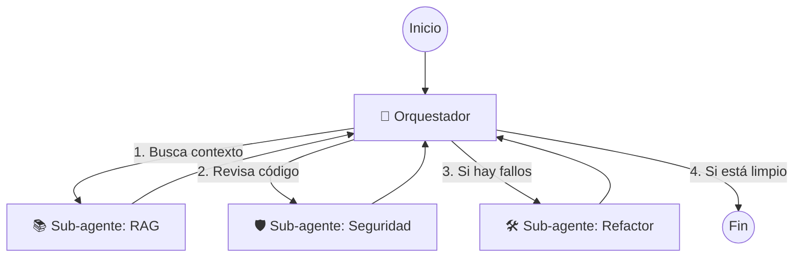
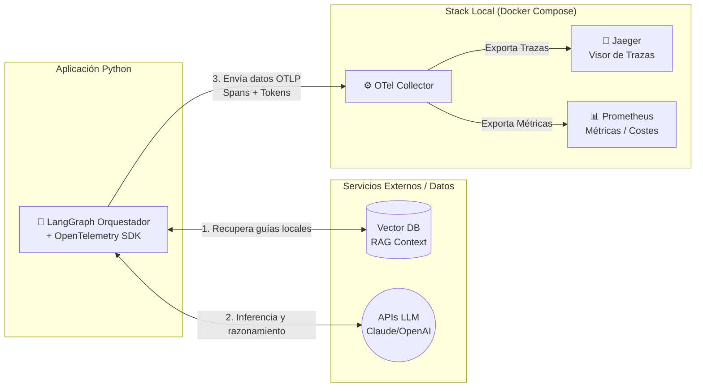

# 🚀 Ejercicio Práctico: Agente Autónomo de Análisis y Refactorización

El ejercicio consiste en construir un sistema multi-agente autónomo capaz de analizar y refactorizar código, gobernando sus decisiones y costes de ejecución. Se busca demostrar que el comportamiento no determinista de los LLMs puede ser trazable, medible y seguro para su paso a producción.

## 🎯 Objetivo

Validar empíricamente la **Observabilidad de IA** y el concepto de **Harness Engineering** (Ingeniería de Arnés).

---

## Pilares Técnicos
*   **Orquestación:** LangGraph (Python) para gestionar el estado y el enrutamiento.
*   **Harness Engineering:** RAG para guías de estilo (Feedforward) y políticas Zero Trust (Feedback).
*   **Observabilidad:** OpenTelemetry interceptando consumos de tokens y trazas del grafo, exportados localmente a Jaeger y Prometheus vía OTel Collector.
*   **Metodología:** OpenSpec Propose (Spec-Driven Development) asistido por Claude Code.

## 🗺️ Arquitectura de Estado: Flujo LangGraph

El flujo se basa en un diseño jerárquico de **1 Orquestador y 3 Sub-agentes**. El Orquestador centraliza el estado global (LangGraph `StateGraph`) y toma decisiones de enrutamiento basadas en las respuestas de los sub-agentes.

## 🏗️ Arquitectura de Componentes y Observabilidad

El sistema separa la lógica del agente de la infraestructura de observabilidad. La aplicación Python instrumentada envía datos en crudo (OTLP) al Collector, el cual se encarga de enrutar las métricas (tokens) y trazas (decisiones) a sus respectivos motores.

